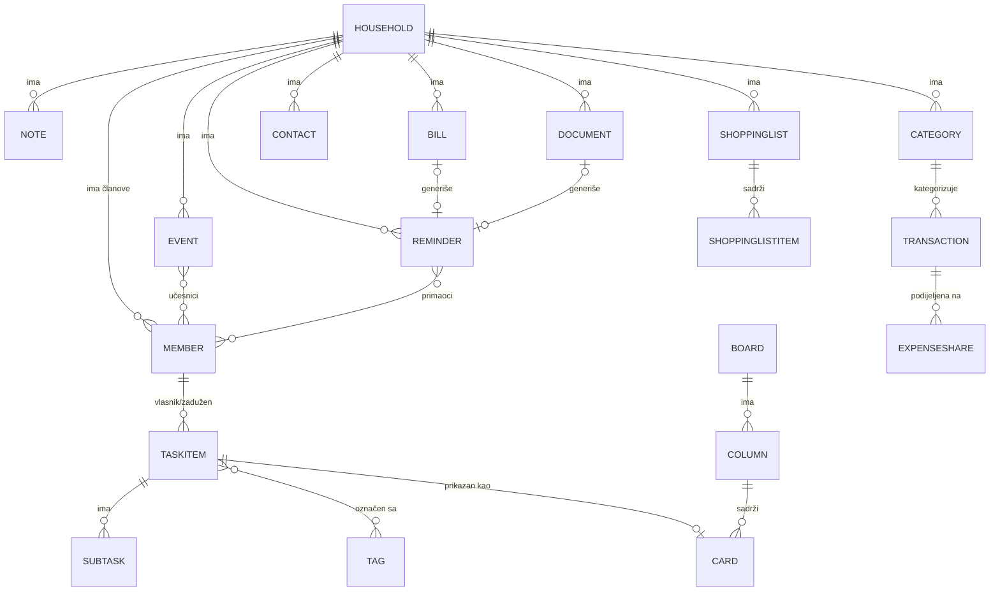

# 04 — Model podataka i struktura baze

> **Status: REFERENTNI DOKUMENT — konsultuje se pri pisanju entiteta, migracija i upita.**
> Ovaj dokument opisuje *strukturu podataka* — konkretno proizilazi iz `00_Specifikacija_Izvor.md` (šta se čuva), `01_Roadmap.md` (kojim redom se entiteti prave, po danu) i `02_Pravila_Programiranja.md` (konvencije imenovanja, folder struktura, EF Core pristup). Ako se tokom pisanja koda otkrije da neko polje/relacija nedostaje ovdje — prvo se dopuni ovaj dokument, pa se onda piše kod, da model ostane jedan izvor istine za bazu.

**Pristup:** Code First sa Entity Framework Core — entiteti (C# klase) su izvor istine, migracije generišu šemu. Ovaj dokument opisuje entitete konceptualno; tačan C# kod nastaje tokom implementacije po modulu, prateći ovdje opisana polja i relacije.

**Odluka o ključevima:** `int` (auto-increment) za sve primarne ključeve — brže za postavku u LocalDB-u, dovoljno za obim ovog projekta. (Alternativa `Guid` je moguća kasnije bez promjene ostatka modela, ako zatreba npr. zbog sinhronizacije više uređaja.)

---

## 1. Zajednička osnova (`Common`)

Svaki entitet koji predstavlja korisnički sadržaj (ne važi za čisto sistemske/lookup tabele) nasljeđuje ili sadrži ova polja — definisano jednom u `BaseEntity`, ne ponavlja se ručno po modulu.

### `BaseEntity` (apstraktna bazna klasa)

| Polje | Tip | Opis |
|---|---|---|
| `Id` | `int` (PK) | Primarni ključ |
| `HouseholdId` | `int` (FK → `Household.Id`) | Kojem domaćinstvu entitet pripada — **obavezno na svemu**, osnova izolacije podataka |
| `OwnerId` | `int` (FK → `Member.Id`) | Ko je kreirao/vlasnik entiteta |
| `Visibility` | `enum` (`Private`, `Household`, `SpecificMembers`) | Kontrola vidljivosti — tri vrijednosti iz izvora: privatno, dijeljeno s cijelim domom, ili dijeljeno s određenim osobama (lista osoba se drži u `ItemShare`, vidi sekciju 10) |
| `CreatedAtUtc` | `DateTime` | Vrijeme kreiranja |
| `UpdatedAtUtc` | `DateTime?` | Vrijeme zadnje izmjene (nullable — null dok nije mijenjano) |
| `IsDeleted` | `bool` (default `false`) | Soft delete — omogućava oporavak, u skladu sa principom iz projektne dokumentacije |

### `Visibility` (enum)
```
Private          → vidljivo samo OwnerId članu
Household        → vidljivo svim članovima istog HouseholdId
SpecificMembers  → vidljivo OwnerId članu + članovima navedenim u ItemShare
```
Provedba u upitima: `VisibleTo(memberId)` (dom + vlastito) i preopterećenje `VisibleTo(memberId, shares, type)` koje dodatno kroz `EXISTS` podupit uključuje stavke dijeljene lično s članom. Vidi `02_Pravila_Programiranja.md`.

**Pravilo indeksiranja:** `HouseholdId` ima indeks na svakoj tabeli koja ga sadrži (skoro sve) — svaki upit filtrira po njemu, pa je ovo kritično za performanse čak i pri malom obimu podataka.

---

## 2. Household modul (osnova sistema — pravi se prvi, Dan 1)

### `Household`
| Polje | Tip | Opis |
|---|---|---|
| `Id` | `int` (PK) | |
| `Name` | `string` | Naziv domaćinstva (npr. "Porodica Hodžić") |
| `CreatedAtUtc` | `DateTime` | |

*Napomena:* `Household` ne nasljeđuje `BaseEntity` (nema smisla da domaćinstvo pripada samom sebi) — ima samo svoja osnovna polja.

### `Member`
| Polje | Tip | Opis |
|---|---|---|
| `Id` | `int` (PK) | |
| `HouseholdId` | `int` (FK → `Household.Id`) | Kojem domaćinstvu pripada |
| `IdentityUserId` | `string` (FK → `AspNetUsers.Id`) | Veza na ASP.NET Core Identity nalog — **ne duplicirati** email/lozinku, Identity ostaje jedini izvor za autentifikaciju |
| `DisplayName` | `string` | Ime prikazano u UI-ju (npr. "Amina") |
| `PreferredCulture` | `string?` | Opciono — zadnji odabrani jezik za ovog člana (ako se odluči čuvati po korisniku umjesto samo u cookie-ju, vidi `02_Pravila_Programiranja.md` sekcija 5) |
| `JoinedAtUtc` | `DateTime` | |

**Relacija:** `Household` (1) ──< `Member` (N). Jedan `IdentityUser` (ASP.NET Core Identity nalog) odgovara tačno jednom `Member` zapisu (1:1) — Identity čuva login podatke, `Member` čuva sve što je specifično za Home OS.

---

## 3. Tasks modul (Dan 1)

### `TaskItem` (nasljeđuje `BaseEntity`)
| Polje | Tip | Opis |
|---|---|---|
| `Title` | `string` | Naziv zadatka |
| `Description` | `string?` | Opis (opciono) |
| `DueDate` | `DateTime?` | Rok — nullable, zadatak može biti bez roka |
| `Priority` | `enum` (`Low`, `Medium`, `High`, `Urgent`) | Prioritet |
| `Status` | `enum` (`Open`, `InProgress`, `Done`) | Status |
| `AssigneeId` | `int?` (FK → `Member.Id`) | Odgovorna osoba — nullable, zadatak može biti nedodijeljen |
| `RecurrenceRule` | `string?` | Pravilo ponavljanja (jednostavan format, npr. `"weekly"`, `"monthly"` — tumači ga `IRecurrenceService` iz `02_Pravila_Programiranja.md`) |
| `ParentTaskId` | `int?` (FK → `TaskItem.Id`, self-reference) | Ako je ovaj zadatak generisan kao sljedeća instanca ponavljajućeg zadatka — veza na "prvobitni" zadatak |

### `SubTask`
| Polje | Tip | Opis |
|---|---|---|
| `Id` | `int` (PK) | |
| `TaskItemId` | `int` (FK → `TaskItem.Id`) | Roditeljski zadatak |
| `Title` | `string` | |
| `IsDone` | `bool` | |
| `SortOrder` | `int` | Redoslijed prikaza u checklisti |

*Napomena:* `SubTask` ne nasljeđuje `BaseEntity` — nasljeđuje vidljivost/vlasništvo od roditeljskog `TaskItem`, nema smisla da podzadatak ima svoj nezavisni `Visibility`.

### `Tag` i `TaskTag` (many-to-many)
| `Tag` | Tip | Opis |
|---|---|---|
| `Id` | `int` (PK) | |
| `HouseholdId` | `int` (FK) | Tagovi su specifični za domaćinstvo, ne globalni |
| `Name` | `string` | npr. "kuhinja", "hitno" |

| `TaskTag` (join tabela) | Tip |
|---|---|
| `TaskItemId` | `int` (FK → `TaskItem.Id`) |
| `TagId` | `int` (FK → `Tag.Id`) |

**Relacije:** `TaskItem` (1) ──< `SubTask` (N) · `TaskItem` (N) ──< `TaskTag` >── (N) `Tag` · `TaskItem` (1) ──< `TaskItem` (N, self, preko `ParentTaskId`).

---

## 4. Kanban modul (Dan 3 — nadograđuje se na Tasks, ne duplicira)

> **Revidirano nakon Dana 3.** Kanban **nema vlastitih entiteta** (`Board`/`Column`/`Card` uklonjeni migracijom `RemoveKanbanBoards`). Izvor opisuje Kanban kao "vizuelni prikaz zadataka organizovanih u kolone" — dakle *pogled* na `TaskItem`, ne zaseban skup podataka. Tabla se **automatski formira od zadataka**:
>
> - Kolone su vrijednosti `TaskState` enuma (`Open` / `InProgress` / `Done`), zaglavlja lokalizovana kroz `TaskEnums`.
> - Kartica = `TaskItem` (link na `Tasks/Edit`), bez kopije podataka.
> - Prevlačenje kartice zove `POST /Kanban/MoveTask` koji mijenja `TaskItem.Status` kroz zajednički `ITaskWorkflowService` (isti kod kao `Tasks/Edit`) — nema više dva mjesta (`Card.ColumnId` + `Status`) koja treba sinhronizovati, pa nestaje i klasa grešaka oko nesklada.
> - Ponavljajući zadatak prebačen u `Done` (i sa table i iz forme) automatski spawn-uje sljedeću instancu (`IRecurrenceService`).
>
> Vidljivost/RBAC se nasljeđuju automatski jer Kanban čita kroz iste `Tasks` upite (`VisibleTo`). Modul je i dalje ravnopravan građanin registra (`KanbanModule` descriptor), samo bez vlastite tabele i bez vlastitog `ISearchable` (zadaci se pretražuju kroz `TaskSearchProvider`).

---

## 5. Calendar modul (Dan 2)

### `Event` (nasljeđuje `BaseEntity`)
| Polje | Tip | Opis |
|---|---|---|
| `Title` | `string` | |
| `StartsAtUtc` | `DateTime` | |
| `EndsAtUtc` | `DateTime` | |
| `Location` | `string?` | Opciono |
| `RecurrenceRule` | `string?` | Isti mehanizam kao kod `TaskItem` — dijeli `IRecurrenceService` |

### `EventAttendee` (many-to-many, ko učestvuje)
| Polje | Tip |
|---|---|
| `EventId` | `int` (FK → `Event.Id`) |
| `MemberId` | `int` (FK → `Member.Id`) |

**Napomena o projekciji zadataka na kalendar:** Zadaci sa `DueDate` se **ne kopiraju** u `Event` tabelu — Kalendar view na nivou koda (kontroler/query) čita i iz `Event` i iz `TaskItem` (gdje `DueDate != null`) i spaja ih u jedan prikaz. Ovo je eksplicitno zahtijevano u specifikaciji ("bez dupliranja podataka").

---

## 6. Reminders modul (Dan 2)

### `Reminder` (nasljeđuje `BaseEntity`)
| Polje | Tip | Opis |
|---|---|---|
| `Title` | `string` | |
| `TriggerAtUtc` | `DateTime` | Kada se aktivira |
| `RecurrenceRule` | `string?` | Isti recurrence mehanizam |
| `SourceType` | `enum` (`Manual`, `Task`, `Bill`, `Document`, `Event`) | Odakle je podsjetnik pokrenut — polymorphic izvor |
| `SourceId` | `int?` | Id entiteta izvora (npr. `TaskItem.Id` ako je `SourceType = Task`) — bez striktnog FK-a jer cilja različite tabele; provjera integriteta na nivou aplikacije, ne baze |
| `IsResolved` | `bool` | Označen kao riješen/pregledan |
| `SnoozedUntilUtc` | `DateTime?` | Odgoda ("snooze") |

### `ReminderRecipient` (many-to-many, ciljani primaoci)
| Polje | Tip |
|---|---|
| `ReminderId` | `int` (FK → `Reminder.Id`) |
| `MemberId` | `int` (FK → `Member.Id`) |
| `NotifiedViaEmail` | `bool` | Da li je e-mail već poslan za ovu instancu (izbjegava duplo slanje) |
| `NotifiedInAppAtUtc` | `DateTime?` | |

**Relacija sa e-mailom:** `Reminder` ne čuva sadržaj e-maila — `IEmailSender` (Resend) generiše sadržaj u trenutku slanja na osnovu `Reminder.Title` i konteksta; nema posebne "email log" tabele u ovom obimu (moguća dopuna u README-u kao V2).

---

## 7. Notes modul (Dan 3)

### `Note` (nasljeđuje `BaseEntity`)
| Polje | Tip | Opis |
|---|---|---|
| `Title` | `string?` | Nullable — dnevničke bilješke mogu nemati poseban naslov (koristi se datum) |
| `Content` | `string` | Tekst bilješke (plain text ili markdown — po `02_Pravila_Programiranja.md`, rich-text nije neophodan za ovaj obim) |
| `IsJournalEntry` | `bool` | Razlikuje običnu bilješku od dnevnog dnevnika |
| `JournalDate` | `DateOnly?` | Popunjeno samo ako je `IsJournalEntry = true` — jedan zapis po datumu po članu |
| `LinkedEntityType` | `enum?` (`Task`, `Bill`, `Event`) | Polymorphic veza — isti princip kao kod `Reminder.SourceType` |
| `LinkedEntityId` | `int?` | |

### `NoteTag` / `Tag` — koristi **isti `Tag` entitet** kao Tasks modul (Tag nije vezan za jedan modul, već za domaćinstvo), preko join tabele `NoteTag` (`NoteId`, `TagId`).

---

## 8. Finance modul (Dan 4) — *implementirano*

> Napomena: konačna implementacija je nešto jednostavnija od prvobitne skice (tip transakcije je na `Transaction`, ne na kategoriji; budžet je jedan po kategoriji za tekući mjesec bez zasebnih Month/Year kolona; veza na auto-podsjetnik ide preko `Reminder.SourceType/SourceId`, ne preko `ReminderId` FK-a — isti obrazac kao Tasks). Tabela ispod odgovara kodu.

### `Category` (household-scoped, ne nasljeđuje `BaseEntity`)
| Polje | Tip | Opis |
|---|---|---|
| `Id` | `int` (PK) | |
| `HouseholdId` | `int` | Indeksiran |
| `Name` | `string` | npr. "Namirnice", "Struja" |

### `Transaction` (nasljeđuje `BaseEntity`)
| Polje | Tip | Opis |
|---|---|---|
| `Description` | `string` | Obavezno |
| `Amount` | `decimal(18,2)` | |
| `Type` | `enum TransactionType` (`Expense`, `Income`) | Budžet i sažetak prate samo `Expense` |
| `CategoryId` | `int?` (FK → `Category.Id`, `SetNull` on delete) | |
| `OccurredOn` | `DateOnly` | Datum transakcije |
| `Shares` | `ICollection<ExpenseShare>` | Opcioni split; `OwnerId` (iz `BaseEntity`) je onaj ko je unio/platio |

### `Budget` (household-scoped)
| Polje | Tip | Opis |
|---|---|---|
| `Id` | `int` (PK) | |
| `HouseholdId` | `int` | |
| `CategoryId` | `int` (FK → `Category.Id`) | |
| `MonthlyLimit` | `decimal(18,2)` | Mjesečni limit; poredi se sa zbirom troškova kategorije u tekućem mjesecu |

*Indeks:* jedinstven na (`HouseholdId`, `CategoryId`) — jedan budžet po kategoriji.

### `Bill` (pretplate/ponavljajući računi, nasljeđuje `BaseEntity`)
| Polje | Tip | Opis |
|---|---|---|
| `Name` | `string` | npr. "Netflix", "Struja" |
| `Amount` | `decimal(18,2)` | |
| `DueDate` | `DateOnly` | Datum dospijeća |
| `RecurrenceRule` | `string?` | Isti format kao drugdje (`monthly`, `yearly`); `null` = jednokratno |
| `IsPaid` | `bool` | Označeno kao plaćeno |

Auto-podsjetnik prije dospijeća: `Bill` kreiranjem objavljuje `BillDueDateCreatedEvent`; `BillDueReminderHandler` pravi `Reminder` sa `SourceType=Bill`, `SourceId=Bill.Id` (3 dana ranije). **Ponovna upotreba Reminders modula, bez FK-a** — ista polymorphic veza kao kod zadataka.

### `ExpenseShare` (split expense)
| Polje | Tip | Opis |
|---|---|---|
| `Id` | `int` (PK) | |
| `TransactionId` | `int` (FK → `Transaction.Id`, `Cascade`) | |
| `MemberId` | `int` (FK → `Member.Id`) | Član kojem pripada udio |
| `Amount` | `decimal(18,2)` | Iznos udjela (podržava i jednaku podjelu i proizvoljne iznose) |

**Relacija:** `Transaction` (1) ──< `ExpenseShare` (N). UI nudi i dugme "podijeli jednako".

---

## 9. Life Admin modul (Dan 4) — *implementirano*

### `Document` (nasljeđuje `BaseEntity`)
| Polje | Tip | Opis |
|---|---|---|
| `Name` | `string` | Obavezno |
| `Category` | `string?` | npr. "Garancija", "Lična dokumenta" (slobodan tekst za ovaj obim) |
| `ExpiryDate` | `DateOnly?` | Datum isteka/obnove |
| `Notes` | `string?` | |
| `FilePath` | `string?` | Nullable — samo metapodaci; upload fajla je V2 hook |

Auto-podsjetnik prije isteka: kreiranje/promjena datuma objavljuje `DocumentExpiryCreatedEvent`; `DocumentExpiryReminderHandler` pravi `Reminder` sa `SourceType=Document`, `SourceId=Document.Id` (7 dana ranije).

### `Contact` (nasljeđuje `BaseEntity`)
| Polje | Tip | Opis |
|---|---|---|
| `Name` | `string` | Obavezno |
| `Role` | `string?` | npr. "Vodoinstalater", "Ljekar" |
| `Phone` | `string?` | |
| `Email` | `string?` | |
| `Notes` | `string?` | |

---

## 10. Shopping Lists modul (Dan 3)

### `ShoppingList` (nasljeđuje `BaseEntity`)
| Polje | Tip | Opis |
|---|---|---|
| `Name` | `string` | npr. "Sedmična kupovina" |

### `ShoppingListItem`
| Polje | Tip | Opis |
|---|---|---|
| `Id` | `int` (PK) | |
| `ShoppingListId` | `int` (FK → `ShoppingList.Id`) | |
| `Name` | `string` | |
| `Quantity` | `string?` | npr. "2kg", "1 kom" — plain string, ne treba struktura za ovaj obim |
| `IsChecked` | `bool` | |
| `AddedByMemberId` | `int?` (FK → `Member.Id`) | |

---

## 11. ER dijagram (pregled ključnih relacija)



*(GitHub automatski renderuje ovaj Mermaid dijagram u pregledu `.md` fajla — koristan za brzi vizuelni pregled bez dodatnog alata.)*

---

## 11a. Platformske (Shell) tabele — proširivost (dopuna, van originalnog modela)

Ove tabele ne pripadaju nijednom pojedinačnom modulu — pripadaju Shell-u/platformi i podržavaju principe proširivosti iz `00_Specifikacija_Izvor.md` (registar modula, kontrola i privatnost). Ne nasljeđuju `BaseEntity` jer nisu korisnički sadržaj, ali su izolovane po `HouseholdId`.

### `ModuleState` (uključenost modula po domaćinstvu)
| Polje | Tip | Opis |
|---|---|---|
| `Id` | `int` (PK) | |
| `HouseholdId` | `int` | Kojem domaćinstvu pripada stanje |
| `ModuleKey` | `string` | Stabilan ključ modula (npr. `"Calendar"`) |
| `IsEnabled` | `bool` | Nepostojanje reda = uključen (default); `false` = domaćinstvo isključilo modul |

*Indeks:* jedinstven na (`HouseholdId`, `ModuleKey`).

### `ModulePermissionState` (grant/opoziv dozvole po domaćinstvu)
| Polje | Tip | Opis |
|---|---|---|
| `Id` | `int` (PK) | |
| `HouseholdId` | `int` | |
| `ModuleKey` | `string` | Modul koji je tražio dozvolu (npr. `"Calendar"`) |
| `Permission` | `string` | Ključ dozvole (npr. `"Tasks.Read"`) |
| `IsGranted` | `bool` | Nepostojanje reda = dato po defaultu (ugrađeni moduli); `false` = opozvano |

*Indeks:* jedinstven na (`HouseholdId`, `ModuleKey`, `Permission`). Detalji mehanizma: `02_Pravila_Programiranja.md`, sekcije 1.5 i 1.9.

### `MemberModuleAccess` (pristup člana modulu — **planirano za Dan 3**)
RBAC po članu, dogovoreno na prelazu Dan 2/3; pravi se zajedno s upravljanjem članovima jer nema smisla bez više članova i owner uloge.

| Polje | Tip | Opis |
|---|---|---|
| `Id` | `int` (PK) | |
| `HouseholdId` | `int` | |
| `MemberId` | `int` (FK → `Member.Id`) | Član na kojeg se pravo odnosi |
| `ModuleKey` | `string` | Modul (npr. `"Calendar"`) |
| `CanAccess` | `bool` | Nepostojanje reda = član vidi modul (default); `false` = owner ograničio |

*Indeks:* jedinstven na (`HouseholdId`, `MemberId`, `ModuleKey`). **Razlika od `ModulePermissionState`:** ovdje je subjekt **član** (osoba smije otvoriti modul), tamo je subjekt **modul** (modul smije čitati tuđe podatke) — dva odvojena sloja, vidi `02_Pravila_Programiranja.md` 1.9.

### `MemberNotificationPreference` (lične postavke obavještenja — dodano nakon Dana 3)
Podržava "Individualna podešavanja obavještenja" iz izvora — svaki član sam pali/gasi kategorije e-mail obavještenja. **Opt-out model:** nepostojanje reda znači "uključeno", pa novi član dobija sva obavještenja dok ih sam ne ograniči na `/NotificationSettings`.

| Polje | Tip | Opis |
|---|---|---|
| `Id` | `int` (PK) | |
| `MemberId` | `int` (FK → `Member.Id`) | Član čija je postavka |
| `Category` | `enum NotificationCategory` | `ReminderDue`, `TaskAssigned`, `BillDue`, `SharedContent` — mapiraju okidače iz izvora ("dospijeće podsjetnika, dodijeljen zadatak, račun pred naplatu, dijeljeni sadržaj") |
| `IsEnabled` | `bool` | `false` = član isključio ovu kategoriju |

*Indeks:* jedinstven na (`MemberId`, `Category`). Provjerava se u `INotificationPreferenceService.IsEnabledAsync` prije svakog slanja (npr. u `ReminderNotificationService` i `TaskAssignedEmailHandler`).

### `ItemShare` (dijeljenje sa specifičnim osobama — dodano nakon Dana 3)
Podržava `Visibility.SpecificMembers`. Jedna polimorfna tabela služi sve module (umjesto zasebne share-tabele po modulu): jedan red = "ova stavka, ovog tipa, vidljiva je ovom članu".

| Polje | Tip | Opis |
|---|---|---|
| `Id` | `int` (PK) | |
| `Type` | `enum ShareableType` | `Task`, `Reminder`, `Note`, `Event`, `ShoppingList` — koji entitet `ItemId` označava |
| `ItemId` | `int` | Id dijeljene stavke (bez stroge FK jer cilja različite tabele — provjera u aplikaciji, isti obrazac kao `Reminder.SourceType`/`SourceId`) |
| `MemberId` | `int` (FK → `Member.Id`) | Kome je stavka dijeljena |

*Indeks:* jedinstven na (`Type`, `ItemId`, `MemberId`). Čita se kroz `EXISTS` podupit u `VisibleTo(memberId, shares, type)`; piše kroz `IItemSharingService.ReplaceSharesAsync`.

---

## 12. Redoslijed kreiranja migracija (usklađeno sa `01_Roadmap.md`)

| Dan | Migracija (predloženi naziv) | Entiteti |
|---|---|---|
| 1 | `InitialCreate` | `Household`, `Member`, Identity tabele |
| 1 | `AddTasks` | `TaskItem`, `SubTask`, `Tag`, `TaskTag` |
| 2 | `AddReminders` | `Reminder`, `ReminderRecipient` |
| 2 | `AddCalendar` | `Event`, `EventAttendee` |
| 2* | `AddModuleStates` | `ModuleState` (platforma — registar modula) |
| 2* | `AddModulePermissions` | `ModulePermissionState` (platforma — dozvole) |
| 3 | `AddKanban` | `Board`, `Column`, `Card` *(kasnije uklonjeno — vidi ispod)* |
| 3 | `AddNotes` | `Note`, `NoteTag` |
| 3 | `AddShoppingLists` | `ShoppingList`, `ShoppingListItem` |
| Rev. | `RemoveKanbanBoards` | Uklanja `Board`/`Column`/`Card` (Kanban postao projekcija zadataka) |
| Rev. | `AddNotificationPreferences` | `MemberNotificationPreference` (lične kategorije obavještenja) |
| Rev. | `AddItemShares` | `ItemShare` (dijeljenje sa specifičnim osobama) |
| 4 | `AddFinance` | `Category`, `Transaction`, `Budget`, `Bill`, `ExpenseShare` |
| 4 | `AddLifeAdmin` | `Document`, `Contact` |

*Migracije označene "Rev." nastale su u reviziji usklađivanja sa izvorom nakon Dana 3 (vidi `01_Roadmap.md`, sekcija "Revizija").*

*\* Platformske migracije (`AddModuleStates`, `AddModulePermissions`) su nastale tokom rada na proširivosti (kraj Dana 2 / prelaz na Dan 3), kad je na zahtjev dograđena arhitektura registra modula, event bus-a, komandne palete i dozvola — vidi `02_Pravila_Programiranja.md`, sekcije 1.4–1.9.*

**Napomena:** manje migracije, jedna po modulu, olakšavaju praćenje istorije i lakše je vratiti se unazad ako nešto zakaže — u skladu sa pravilom "male, česte promjene" iz `02_Pravila_Programiranja.md`.

---

## 13. Otvorena pitanja / svjesna pojednostavljenja (za README)

- `Visibility` podržava sve tri vrijednosti iz izvora: `Private`/`Household`/`SpecificMembers` (lista osoba u `ItemShare`). Picker za odabir osoba je za sada izložen u Tasks formama; ostali moduli poštuju dijeljenje na nivou čitanja, a njihov picker je jednostavno dodavanje (isti servis) kad zatreba.
- **Real-time sinhronizacija** je implementirana preko SignalR-a (`HouseholdHub` + globalni broadcast filter + `wwwroot/js/realtime.js`) — promjena jednog člana osvježava ekrane drugih bez ručnog reload-a (vidi `01_Roadmap.md`, "Sinhronizacija u realnom vremenu"). Klijent radi ciljani reload relevantne stranice; granularni DOM patch je moguća V2 optimizacija.
- **E-mail** ide preko Gmail SMTP-a (MailKit, App Password), a ne Resend-a — realno šalje bilo kom primaocu. Mailovi za dodijeljeni zadatak i dospjeli podsjetnik sadrže apsolutni link do stavke (`IAppUrlBuilder`).
- `SourceType`/`SourceId` (kod `Reminder` i `Note`) su polymorphic veze bez striktnog FK-a na nivou baze — provjera pripadnosti se radi u kodu. Ovo je namjerno pojednostavljenje radi brzine; alternativa (odvojene tabele veza po tipu) je moguća naknadna izmjena.
- `Document.FilePath` je pripremljen za upload fajla, ali sam upload nije dio ovog obima (nullable polje, spremno za V2).
- `PreferredCulture` na `Member` je opciono polje — ako se u implementaciji odluči da je dovoljan samo cookie za jezik (kako je opisano u `02_Pravila_Programiranja.md` sekcija 5), ovo polje se može izostaviti bez uticaja na ostatak modela.
